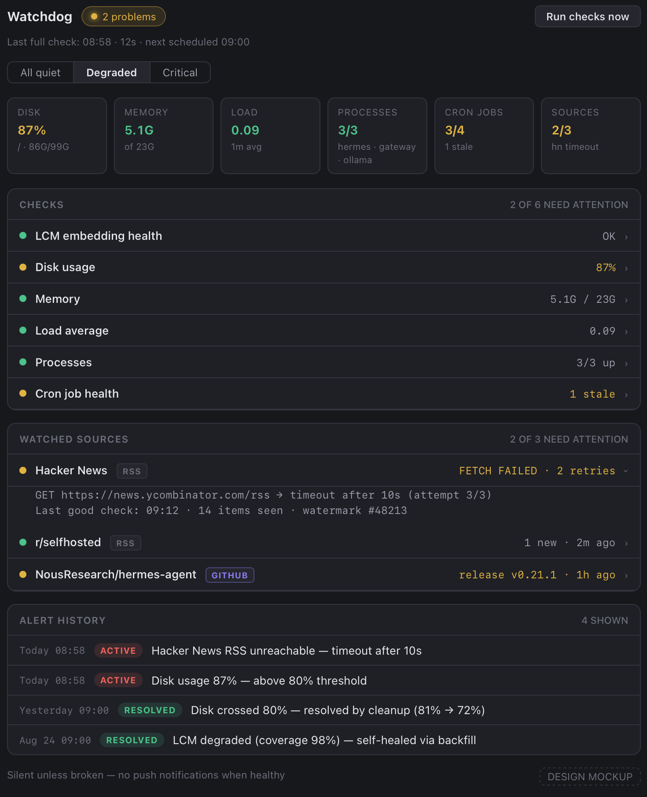

# Watchdog

A statusbar chip + `/watchdog` **plugin** pane for the [Hermes Agent](https://hermes-agent.nousresearch.com) desktop app — a visibility layer for your Hermes host's health, backed by a small read-only FastAPI status service (the plugin's own backend — not the Hermes gateway, not the Hermes web dashboard, not the API server).

## What it is

| Piece | What it does |
|---|---|
| **Statusbar chip** | Green "all quiet" / amber "degraded" / red "N problems" — one glance, no noise |
| **`/watchdog` plugin pane** | Live checks, **watched sources** (RSS feeds + a GitHub repo with new-item counts), and an **alert history** (transition log: opens on worsening, resolves on recovery) |
| **FastAPI backend** | The plugin's own read-only status service — NOT the Hermes gateway (`hermes gateway`), NOT the Hermes web dashboard (`hermes dashboard`, 9119), and NOT the OpenAI-compatible API server (8642). Endpoints: `/health`, `/status`, `/alerts`, `/sources`, `/config`, `/run-check` |

**Design principle: one source of truth.** The backend shells out to the SAME check scripts the daily cron watchdog uses (`~/.hermes/scripts/lcm_daily_check.py` + `lcm_health_check.py`), so the pane and the cron always agree. The cron stays the alerting layer (silent-unless-broken); this plugin is the visibility layer (on-demand, in-app).

## Screenshot



## Layout

```
watchdog_api.py            FastAPI service: /health, /status, /alerts,
                           /sources, /config, /run-check
watchdog_config.json       thresholds + watched sources (hot-reloaded)
.env.example               backend env vars (copy to .env)
scripts/stamp-version.sh   stamp the git tag into plugin.js header + version
state/                     runtime state, gitignored: alerts.json (transition
                           log), sources.json (watermark cursors)
desktop-plugin/            plugin.js — the desktop plugin (copy to
                           ~/.hermes/desktop-plugins/watchdog/)
docs/mockup.html           approved mockup
docs/watchdog-pane.png     screenshot of the pane (degraded state)
```

## Requirements

- Python 3.11+ (`fastapi`, `uvicorn[standard]`)
- A Hermes Agent install (the desktop app + `~/.hermes` layout)
- The watchdog backend running (below) — the desktop plugin is its UI; if it can't reach the backend it shows an unreachable state in the chip/pane
- Hermes-LCM (for the LCM embedding-health check) — the check degrades gracefully if its script is absent

## Running the backend

```bash
git clone https://github.com/odine1980/watchdog-desktop-plugin.git watchdog && cd watchdog
python3 -m venv .venv && .venv/bin/pip install fastapi "uvicorn[standard]"
.venv/bin/python -m uvicorn watchdog_api:app --host 127.0.0.1 --port 8766
```

The backend reads its configuration from env vars (below). Copy `.env.example` to `.env` and edit, then pass it to uvicorn:

```bash
cp .env.example .env
.venv/bin/python -m uvicorn watchdog_api:app --env-file .env
```

### Configuration (env vars)

| Var | Default | Purpose |
|---|---|---|
| `WATCHDOG_HOST` | `127.0.0.1` | Bind address — keep it on a private interface |
| `WATCHDOG_PORT` | `8766` | Port |
| `HERMES_HOME` | `~/.hermes` | Where `scripts/`, `lcm.db`, `cron/jobs.json` live |
| `DAILY_DISK_ALERT_PCT` | `80` | Disk threshold |

These configure the **backend** only. The plugin has a single config value of its own — `WATCHDOG_BACKEND_URL` inside `plugin.js` (see Plugin install).

Read-only by design — `/run-check` only re-runs checks; nothing here mutates. CORS is open because the desktop app renderer fetches cross-origin. **Add a token before ever exposing it wider than a private network.**

### systemd (user unit, starts at boot)

Save as `~/.config/systemd/user/watchdog-backend.service` (adjust `WorkingDirectory` to your clone location):

```ini
[Unit]
Description=Watchdog status service (desktop plugin backend)
After=network.target

[Service]
WorkingDirectory=%h/watchdog
ExecStart=%h/watchdog/.venv/bin/python -m uvicorn watchdog_api:app --host 127.0.0.1 --port 8766
Restart=always
Environment=HERMES_HOME=%h/.hermes

[Install]
WantedBy=default.target
```

```bash
systemctl --user daemon-reload
systemctl --user enable --now watchdog-backend.service
systemctl --user status watchdog-backend.service   # → active (running)
```

To reach it from another machine (e.g. the desktop app in remote mode), bind `--host 0.0.0.0` and point the plugin at the host's Tailscale/LAN IP.

## Checks surfaced

| id | check | source |
|---|---|---|
| lcm | embedding health (coverage, provider, last embed) + db integrity + summary backlog | `lcm_health_check.py` + direct `lcm.db` reads |
| disk | worst usage vs threshold (`thresholds.disk_pct`, default 80) | `df` |
| mem | free + loadavg (informational) | `free`, `/proc/loadavg` |
| processes | ollama, gateway running | `pgrep` |
| cron | jobs.json audit: failures + staleness per cadence | `~/.hermes/cron/jobs.json` |

## Alert history

`update_alerts()` runs on every `/status` poll and records *transitions*, not snapshots: opening an alert when a check worsens, resolving it on recovery, updating severity/message on escalation. The **first run is a silent baseline** — pre-existing problems never spam the history. Persisted atomically to `state/alerts.json`; capped at `alerts.max_kept` (default 50). Active (unresolved) alerts always sort above resolved.

## Watched sources

Configured in `watchdog_config.json` → `sources[]`. Each source keeps a watermark cursor in `state/sources.json`; `/sources` reports new-item counts since the watermark. RSS uses the item guid (falling back to link, then title); GitHub compares the latest release tag. Fetch failures degrade that source only — they never flip the overall chip. `kind`: `rss` (url) or `github` (repo + ref, default `releases/latest`).

## Plugin install

The plugin is a **single ESM file**, loaded uncompiled — no build step. The folder name must equal the plugin id (`watchdog`).

1. Clone this repo and copy the plugin into the desktop-plugin directory on the machine running the Hermes desktop app:

```bash
git clone https://github.com/odine1980/watchdog-desktop-plugin.git
mkdir -p ~/.hermes/desktop-plugins/watchdog
cp watchdog-desktop-plugin/desktop-plugin/plugin.js ~/.hermes/desktop-plugins/watchdog/plugin.js
```

2. **One config value** — `WATCHDOG_BACKEND_URL` at the top of `plugin.js` points at the watchdog status service (not the Hermes gateway, not the dashboard, not the API server). The plugin's fetches run in the desktop app's renderer, so the URL must be reachable from the machine the app runs on:

| Setup | `WATCHDOG_BACKEND_URL` |
|---|---|
| Hermes + backend on this machine | `http://127.0.0.1:8766` (the default — no edit) |
| Remote host (Tailscale/LAN) | `http://<host-ip>:8766` — e.g. `http://100.x.y.z:8766` or a LAN IP |

3. The backend must be running, or the chip/pane shows an unreachable state.

4. In the desktop app: **⌘K → Reload desktop plugins** (hot-reload usually picks it up on save).

### Troubleshooting

- **Pane shows *backend unreachable*** → check the backend service is active and `WATCHDOG_BACKEND_URL` is reachable from the app's machine (`curl http://<host-ip>:8766/health`).
- **Stale version** → **⌘K → Reload desktop plugins**; if it persists, restart the desktop app.
- **LCM actions card missing** → the backend reports LCM not present (no `lcm.db`/health script); the card hides itself by design.

## Releasing (version stamping)

The plugin version lives in exactly one place: the **git tag**. `scripts/stamp-version.sh` reads the newest tag and stamps it into both the `@version` header line and the `version:` field of `plugin.js` — the version never needs hand-editing.

```bash
git tag v1.0.3
./scripts/stamp-version.sh     # stamps "1.0.3" into desktop-plugin/plugin.js
git add desktop-plugin/plugin.js CHANGELOG.md
git commit -m "release v1.0.3"
git push --follow-tags
```

## License

MIT
